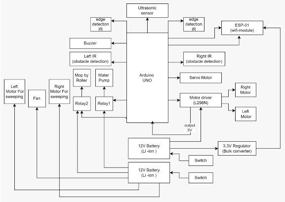
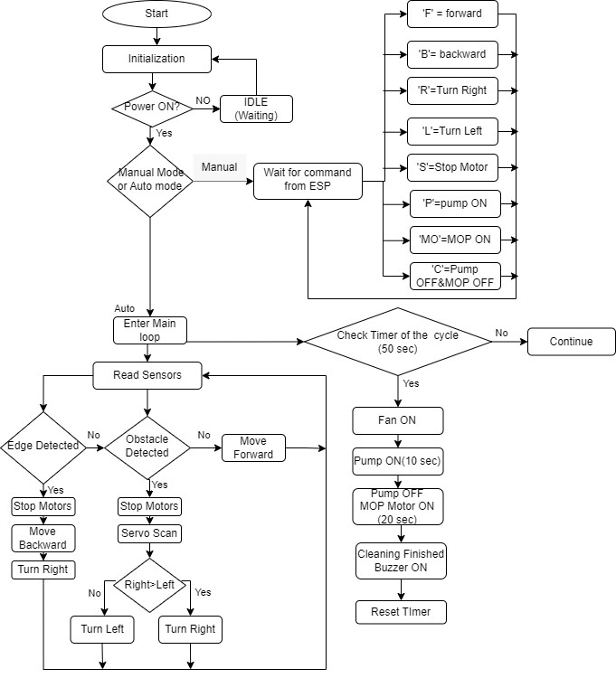
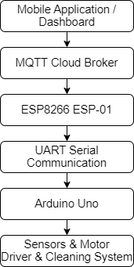
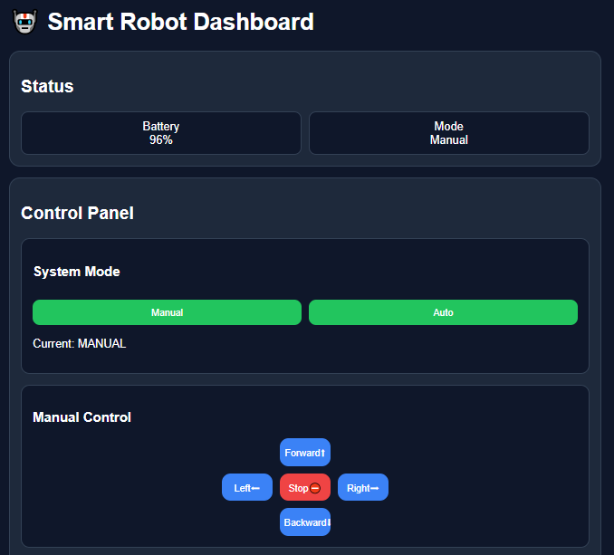
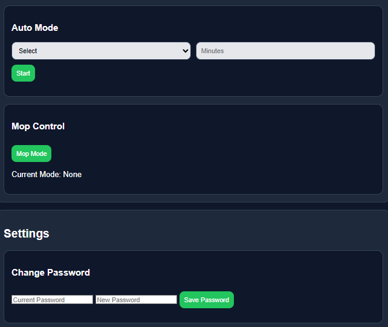
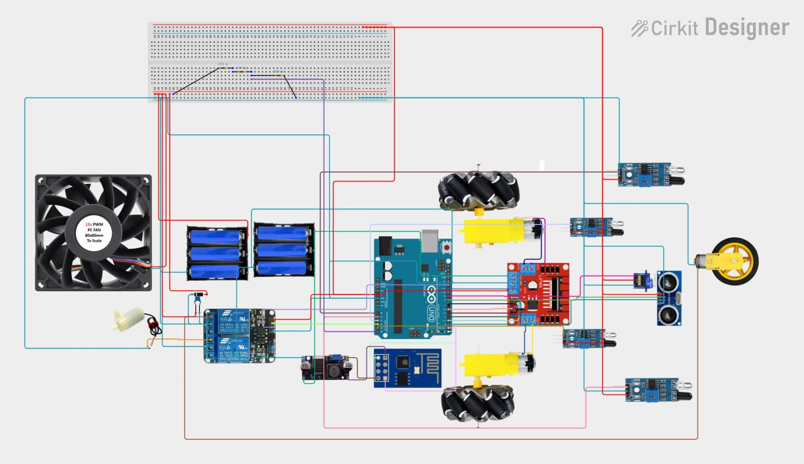

# 🧠 Smart Autonomous Cleaning & AI Waste Classification Robot

## 📌 Overview

An IoT-based autonomous cleaning robot that integrates embedded systems, artificial intelligence, and cloud communication to enable intelligent indoor cleaning and real-time waste classification.

#### The system combines:

- Arduino Uno for real-time embedded control and sensor processing  
- ESP8266 module for MQTT-based cloud communication and remote connectivity  
- Deep learning-based AI model (MobileNetV2) for waste classification (plastic, paper, metal, glass, etc.)  

#### 🎯System Goal
- Develop an intelligent low cost autonomous cleaning robot  
- Integrate AI based waste classification with IoT communication
- Improve indoor cleaning efficiency and reduce human effort

---

## ✨ Key Features

- A multi-stage autonomous cleaning cycle that executes sweeping, vacuum cleaning, wetting, and mopping operations  
- Real-time obstacle and edge avoidance using ultrasonic and IR sensors  
- AI-based waste classification using MobileNetV2 deep learning model  
- MQTT-based IoT remote control and communication system  
- Embedded real-time control for navigation and cleaning synchronization  

---

## 🧩 System Architecture Diagram

The diagram below presents the hardware architecture and subsystem interconnections of the smart cleaning robot.

<p align="center">
  
</p>

---

## ⚙️ System Operation Modes

The robot supports two operational modes controlled remotely through the MQTT cloud dashboard.

---

### 1️⃣ Manual Mode

| Description | Flowchart |
|------------|----------|
| In **Manual Mode**, the user can directly control the robot movement and cleaning modules through the web dashboard interface. <br><br> **Supported Controls:** <br> - Forward / Backward Movement <br> - Left / Right Turning <br> - Stop <br> - Water Pump Control <br> - Cleaning Module Activation <br><br> **Use Cases:** <br> - Direct navigation <br> - System testing <br> - Manual cleaning operation |  |

---

### 2️⃣ Autonomous Mode

In **Autonomous Mode**, the robot performs intelligent navigation and periodic cleaning automatically without user intervention.

#### 🔹 Autonomous Navigation

The robot continuously monitors its surroundings using:

- HC-SR04 Ultrasonic Sensor  
- Left & Right IR Obstacle Sensors  
- IR Edge Detection Sensor  

#### 🧠 Navigation Logic

- Edge detection has the highest priority to prevent falling from edges or stairs  
- Obstacles are avoided using real-time distance evaluation  
- The robot dynamically changes direction based on sensor feedback  

▶️ **Watch Demo:**  
[Watch Video](videos/avoidnace.mp4)

---

### 🧼 Multi-Stage Cleaning Cycle

The cleaning system is implemented using a **non-blocking embedded state machine**, allowing cleaning operations and autonomous navigation to run simultaneously.

| Stage | Function | Relay Status | System Action |
|------|----------|--------------|----------------|
| Stage 1 | Vacuum Cleaning | Pump OFF / Mop OFF / Fan ON | Dust collection and suction fan operation while moving |
| Stage 2 | Water Spraying | Pump ON / Mop OFF | Activates water pump for wet cleaning |
| Stage 3 | Mopping | Pump OFF / Mop ON | Mop motor scrubs the surface |

#### ✅ End of Cycle
- Cleaning modules are disabled  
- Buzzer alert is triggered  
- Robot returns to autonomous mode  

▶️ **Watch Demo:**  
[Watch Video](videos/avoidnace&cycle.mp4)

---

## 🌐 Interactive Web Dashboard & Real-Time Cloud Communication

The robot is controlled through a responsive web dashboard using **HTML, CSS, and JavaScript**, with MQTT cloud communication.

---

### ⚙️ Key Features

- Manual & Automatic modes  
- Configurable automatic timer  
- Real-time battery monitoring  
- Password security system  

---

### 💡 System Overview

The dashboard is the main control interface, sending commands via MQTT broker and receiving live status updates.

---

### ☁️ MQTT Cloud Communication Logic

| MQTT Topic | Direction | Function |
|------------|----------|----------|
| robot/control | Subscribe | Receives movement + mode commands |
| robot/telemetry | Publish | Sends battery + system status |

<p align="center">
  
</p>

---

### 🖼️ Dashboard Preview

| Dashboard View 1 | Dashboard View 2 |
|------------------|------------------|
|  |  |

---

## 🔌 Hardware Configurations & Diagrams

The electrical subsystem interconnections and hardware validation before prototyping.

<p align="center">
  
</p>

---

## 🧠 AI Waste Classification Model (Software Layer)

### **AI System Overview**

- Recycle Waste Classifier using Deep Learning  
- Classes: Plastic, Glass, Metal, Paper, Shoes/Other  
- Built with TensorFlow + Streamlit  

---

### **Project Evolution**

- Custom CNN → ~66% accuracy  
- MobileNetV2 → ~90%+ accuracy (final model)  

---

### **Deep Learning Model**

- MobileNetV2 Transfer Learning  
- Lightweight and optimized for real-time  

```python
base_model = MobileNetV2(input_shape=(224, 224, 3),
                          include_top=False,
                          weights='imagenet')

GlobalAveragePooling2D() → Dense(128, relu) → Dropout(0.3) → Dense(num_classes, softmax)
